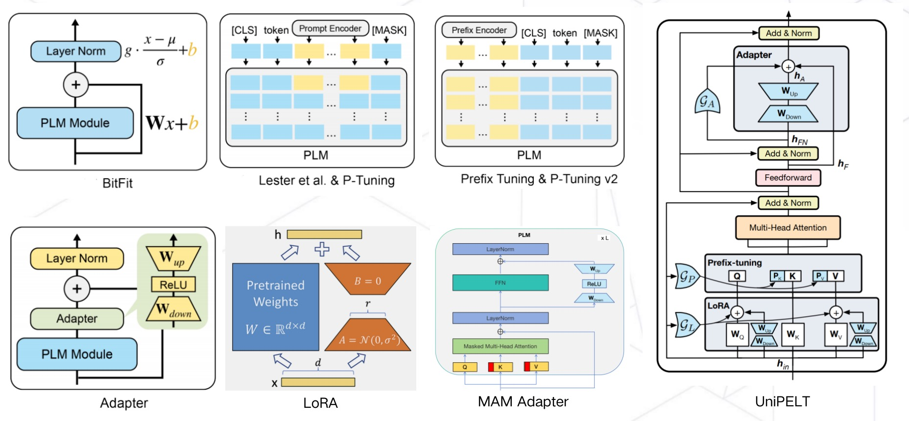
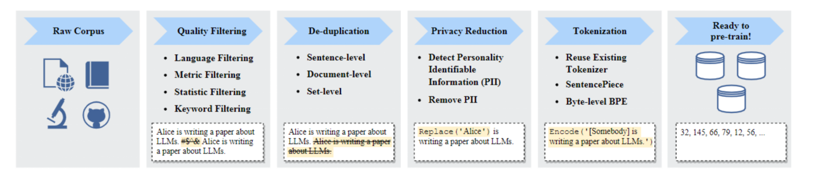
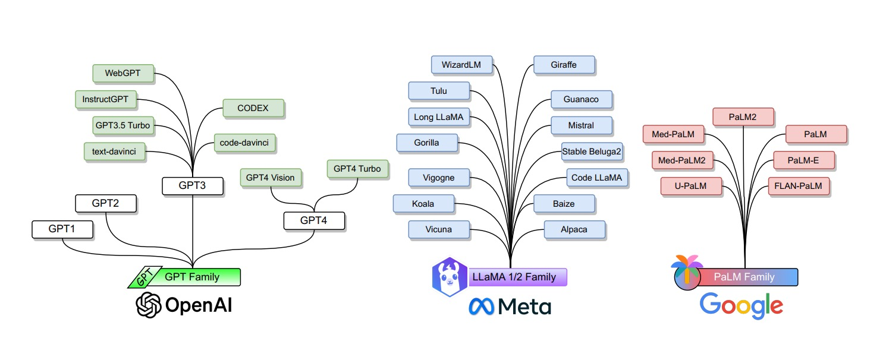

  

 

 

## 目录

- :snail: [LLM训练](#llm训练)
  - 🐫 [LLM训练实战](#llm训练实战)
  - 🐼 [LLM参数高效微调技术原理](#llm微调技术原理)
  - 🐰 [LLM参数高效微调技术实战](#llm微调实战)
  - 🐘 [LLM分布式训练并行技术](#llm分布式训练并行技术)
  - 🌋 [分布式AI框架](#分布式ai框架)
  - 📡 [分布式训练网络通信](#分布式训练网络通信)
  - :herb: [LLM训练优化技术](#llm训练优化技术)
  - :hourglass: [LLM对齐技术](#llm对齐技术)
- 🐎 [LLM推理](#llm推理)
  - 🚀 [LLM推理框架](#llm推理框架)
  - ✈️ [LLM推理优化技术](#llm推理优化技术)
- ♻️ [LLM压缩](#llm压缩)
  - 📐 [LLM量化](#llm量化)
  - 🔰 [LLM剪枝](#llm剪枝)
  - 💹 [LLM知识蒸馏](#llm知识蒸馏)
  - ♑️ [低秩分解](#低秩分解)
- :herb: [LLM测评](#llm测评)
- :palm_tree: [LLM数据工程](#llm数据工程)
  - :dolphin: [LLM微调高效数据筛选技术](#llm微调高效数据筛选技术)
- :cyclone: [提示工程](#提示工程)
- ♍️ [LLM算法架构](#llm算法架构)
- :jigsaw: [LLM应用开发](#llm应用开发)
- 🀄️ [LLM国产化适配](#llm国产化适配)
- 🔯 [AI编译器](#ai编译器)
- 🔘 [AI基础设施](#ai基础设施)
  - :maple_leaf: [AI加速卡](#ai加速卡)
  - :octocat: [AI集群网络通信](#ai集群网络通信)
- 💟 [LLMOps](#llmops)
- 🍄 [LLM生态相关技术](#llm生态相关技术)
- 💹 [LLM性能分析](#llm性能分析)
- :dizzy: [LLM面试题](#llm面试题)
- 🔨 [服务器基础环境安装及常用工具](#服务器基础环境安装及常用工具)
- 💬 [LLM学习交流群](#llm学习交流群)
- 👥 [微信公众号](#微信公众号)
- ⭐️ [Star History](#star-history)
- :link: [AI工程化课程推荐](#ai工程化课程推荐)

## LLM训练

### LLM训练实战

下面汇总了我在大模型实践中训练相关的所有教程。从6B到65B，从全量微调到高效微调（LoRA，QLoRA，P-Tuning v2），再到RLHF（基于人工反馈的强化学习）。

| LLM                         | 预训练/SFT/RLHF...            | 参数     | 教程                                                                                                                                                                                                                     | 代码                                                                                     |
| --------------------------- | ----------------------------- | -------- | ------------------------------------------------------------------------------------------------------------------------------------------------------------------------------------------------------------------------ | ---------------------------------------------------------------------------------------- |
| Alpaca                      | full fine-turning             | 7B       | [从0到1复现斯坦福羊驼（Stanford Alpaca 7B）](https://zhuanlan.zhihu.com/p/618321077)                                                                                                                                        | [配套代码](https://github.com/liguodongiot/llm-action/tree/main/llm-train/alpaca)               |
| Alpaca(LLaMA)               | LoRA                          | 7B~65B   | 1.[足够惊艳，使用Alpaca-Lora基于LLaMA(7B)二十分钟完成微调，效果比肩斯坦福羊驼](https://zhuanlan.zhihu.com/p/619426866) 2. [使用 LoRA 技术对 LLaMA 65B 大模型进行微调及推理](https://zhuanlan.zhihu.com/p/632492604)    | [配套代码](https://github.com/liguodongiot/llm-action/tree/main/llm-train/alpaca-lora)          |
| BELLE(LLaMA/Bloom)          | full fine-turning             | 7B       | 1.[基于LLaMA-7B/Bloomz-7B1-mt复现开源中文对话大模型BELLE及GPTQ量化](https://zhuanlan.zhihu.com/p/618876472)   2. [BELLE(LLaMA-7B/Bloomz-7B1-mt)大模型使用GPTQ量化后推理性能测试](https://zhuanlan.zhihu.com/p/621128368) | N/A                                                                                      |
| ChatGLM                     | LoRA                          | 6B       | [从0到1基于ChatGLM-6B使用LoRA进行参数高效微调](https://zhuanlan.zhihu.com/p/621793987)                                                                                                                                      | [配套代码](https://github.com/liguodongiot/llm-action/tree/main/train/chatglm-lora)         |
| ChatGLM                     | full fine-turning/P-Tuning v2 | 6B       | [使用DeepSpeed/P-Tuning v2对ChatGLM-6B进行微调](https://zhuanlan.zhihu.com/p/622351059)                                                                                                                                     | [配套代码](https://github.com/liguodongiot/llm-action/tree/main/train/chatglm)              |
| Vicuna(LLaMA)               | full fine-turning             | 7B       | [大模型也内卷，Vicuna训练及推理指南，效果碾压斯坦福羊驼](https://zhuanlan.zhihu.com/p/624012908)                                                                                                                            | N/A                                                                                      |
| OPT                         | RLHF                          | 0.1B~66B | 1.[一键式 RLHF 训练 DeepSpeed Chat（一）：理论篇](https://zhuanlan.zhihu.com/p/626159553)   2. [一键式 RLHF 训练 DeepSpeed Chat（二）：实践篇](https://zhuanlan.zhihu.com/p/626214655)                                 | [配套代码](https://github.com/liguodongiot/llm-action/tree/main/train/deepspeedchat)        |
| MiniGPT-4(LLaMA)            | full fine-turning             | 7B       | [大杀器，多模态大模型MiniGPT-4入坑指南](https://zhuanlan.zhihu.com/p/627671257)                                                                                                                                             | N/A                                                                                      |
| Chinese-LLaMA-Alpaca(LLaMA) | LoRA（预训练+微调）           | 7B       | [中文LLaMA&amp;Alpaca大语言模型词表扩充+预训练+指令精调](https://zhuanlan.zhihu.com/p/631360711)                                                                                                                            | [配套代码](https://github.com/liguodongiot/llm-action/tree/main/train/chinese-llama-alpaca) |
| LLaMA                       | QLoRA                         | 7B/65B   | [高效微调技术QLoRA实战，基于LLaMA-65B微调仅需48G显存，真香](https://zhuanlan.zhihu.com/p/636644164)                                                                                                                         | [配套代码](https://github.com/liguodongiot/llm-action/tree/main/train/qlora)                |
| LLaMA                       | GaLore                         | 60M/7B   | [突破内存瓶颈，使用 GaLore 一张4090消费级显卡也能预训练LLaMA-7B](https://zhuanlan.zhihu.com/p/686686751)   | [配套代码](https://github.com/liguodongiot/llm-action/blob/main/train/galore/torchrun_main.py)  |

**[⬆ 一键返回目录](#目录)**

### LLM微调技术原理

对于普通大众来说，进行大模型的预训练或者全量微调遥不可及。由此，催生了各种参数高效微调技术，让科研人员或者普通开发者有机会尝试微调大模型。

因此，该技术值得我们进行深入分析其背后的机理，本系列大体分七篇文章进行讲解。

- [大模型参数高效微调技术原理综述（一）-背景、参数高效微调简介](https://zhuanlan.zhihu.com/p/635152813)
- [大模型参数高效微调技术原理综述（二）-BitFit、Prefix Tuning、Prompt Tuning](https://zhuanlan.zhihu.com/p/635686756)
- [大模型参数高效微调技术原理综述（三）-P-Tuning、P-Tuning v2](https://zhuanlan.zhihu.com/p/635848732)
- [大模型参数高效微调技术原理综述（四）-Adapter Tuning及其变体](https://zhuanlan.zhihu.com/p/636038478)
- [大模型参数高效微调技术原理综述（五）-LoRA、AdaLoRA、QLoRA](https://zhuanlan.zhihu.com/p/636215898)
- [大模型参数高效微调技术原理综述（六）-MAM Adapter、UniPELT](https://zhuanlan.zhihu.com/p/636362246)
- [大模型参数高效微调技术原理综述（七）-最佳实践、总结](https://zhuanlan.zhihu.com/p/649755252)

### LLM微调实战

下面给大家分享**大模型参数高效微调技术实战**，该系列主要针对 HuggingFace PEFT 框架支持的一些高效微调技术进行讲解。

| 教程                                                                                                | 代码                                                                                                      | 框架             |
| --------------------------------------------------------------------------------------------------- | --------------------------------------------------------------------------------------------------------- | ---------------- |
| [大模型参数高效微调技术实战（一）-PEFT概述及环境搭建](https://zhuanlan.zhihu.com/p/651744834)          | N/A                                                                                                       | HuggingFace PEFT |
| [大模型参数高效微调技术实战（二）-Prompt Tuning](https://zhuanlan.zhihu.com/p/646748939)               | [配套代码](https://github.com/liguodongiot/llm-action/blob/main/llm-action/peft/clm/peft_prompt_tuning_clm.ipynb) | HuggingFace PEFT |
| [大模型参数高效微调技术实战（三）-P-Tuning](https://zhuanlan.zhihu.com/p/646876256)                    | [配套代码](https://github.com/liguodongiot/llm-action/blob/main/llm-action/peft/clm/peft_p_tuning_clm.ipynb)      | HuggingFace PEFT |
| [大模型参数高效微调技术实战（四）-Prefix Tuning / P-Tuning v2](https://zhuanlan.zhihu.com/p/648156780) | [配套代码](https://github.com/liguodongiot/llm-action/blob/main/llm-action/peft/clm/peft_p_tuning_v2_clm.ipynb)   | HuggingFace PEFT |
| [大模型参数高效微调技术实战（五）-LoRA](https://zhuanlan.zhihu.com/p/649315197)                        | [配套代码](https://github.com/liguodongiot/llm-action/blob/main/llm-action/peft/clm/peft_lora_clm.ipynb)          | HuggingFace PEFT |
| [大模型参数高效微调技术实战（六）-IA3](https://zhuanlan.zhihu.com/p/649707359)                         | [配套代码](https://github.com/liguodongiot/llm-action/blob/main/llm-action/peft/clm/peft_ia3_clm.ipynb)           | HuggingFace PEFT |
| [大模型微调实战（七）-基于LoRA微调多模态大模型](https://zhuanlan.zhihu.com/p/670048482)       |     [配套代码](https://github.com/liguodongiot/llm-action/blob/main/llm-action/peft/multimodal/blip2_lora_int8_fine_tune.py) | HuggingFace PEFT |
| [大模型微调实战（八）-使用INT8/FP4/NF4微调大模型](https://zhuanlan.zhihu.com/p/670116171)    |     [配套代码](https://github.com/liguodongiot/llm-action/blob/main/llm-action/peft/multimodal/finetune_bloom_bnb_peft.ipynb) | PEFT、bitsandbytes |

**[⬆ 一键返回目录](#目录)**

### [LLM分布式训练并行技术](https://github.com/liguodongiot/llm-action/tree/main/docs/llm-base/distribution-parallelism)

近年来，随着Transformer、MOE架构的提出，使得深度学习模型轻松突破上万亿规模参数，传统的单机单卡模式已经无法满足超大模型进行训练的要求。因此，我们需要基于单机多卡、甚至是多机多卡进行分布式大模型的训练。

而利用AI集群，使深度学习算法更好地从大量数据中高效地训练出性能优良的大模型是分布式机器学习的首要目标。为了实现该目标，一般需要根据硬件资源与数据/模型规模的匹配情况，考虑对计算任务、训练数据和模型进行划分，从而进行分布式训练。因此，分布式训练相关技术值得我们进行深入分析其背后的机理。

下面主要对大模型进行分布式训练的并行技术进行讲解，本系列大体分九篇文章进行讲解。

- [大模型分布式训练并行技术（一）-概述](https://zhuanlan.zhihu.com/p/598714869)
- [大模型分布式训练并行技术（二）-数据并行](https://zhuanlan.zhihu.com/p/650002268)
- [大模型分布式训练并行技术（三）-流水线并行](https://zhuanlan.zhihu.com/p/653860567)
- [大模型分布式训练并行技术（四）-张量并行](https://zhuanlan.zhihu.com/p/657921100)
- [大模型分布式训练并行技术（五）-序列并行](https://zhuanlan.zhihu.com/p/659792351)
- [大模型分布式训练并行技术（六）-多维混合并行](https://zhuanlan.zhihu.com/p/661279318)
- [大模型分布式训练并行技术（七）-自动并行](https://zhuanlan.zhihu.com/p/662517647)
- [大模型分布式训练并行技术（八）-MOE并行](https://zhuanlan.zhihu.com/p/662518387)
- [大模型分布式训练并行技术（九）-总结](https://zhuanlan.zhihu.com/p/667051845)

**[⬆ 一键返回目录](#目录)**

### 分布式AI框架

- [PyTorch](https://github.com/liguodongiot/llm-action/tree/main/train/pytorch/)
  - PyTorch 单机多卡训练
  - PyTorch 多机多卡训练
- [Megatron-LM](https://github.com/liguodongiot/llm-action/tree/main/train/megatron)
  - Megatron-LM 单机多卡训练
  - Megatron-LM 多机多卡训练
  - [基于Megatron-LM从0到1完成GPT2模型预训练、模型评估及推理](https://juejin.cn/post/7259682893648724029)
- [DeepSpeed](https://github.com/liguodongiot/llm-action/tree/main/train/deepspeed)
  - DeepSpeed 单机多卡训练
  - DeepSpeed 多机多卡训练
- [Megatron-DeepSpeed](https://github.com/liguodongiot/llm-action/tree/main/train/megatron-deepspeed)
  - 基于 Megatron-DeepSpeed 从 0 到1 完成 LLaMA 预训练
  - 基于 Megatron-DeepSpeed 从 0 到1 完成 Bloom 预训练

### 分布式训练网络通信

待更新...

### LLM训练优化技术

- FlashAttention V1、V2
- 混合精度训练
- 重计算
- MQA / GQA
- 梯度累积

### LLM对齐技术

- PPO（近端策略优化）
- DPO
- ORPO

**[⬆ 一键返回目录](#目录)**

## [LLM推理](https://github.com/liguodongiot/llm-action/tree/main/inference)

### 模型推理引擎

- [大模型推理框架概述](https://www.zhihu.com/question/625415776/answer/3243562246)
- [大模型的好伙伴，浅析推理加速引擎FasterTransformer](https://zhuanlan.zhihu.com/p/626008090)
- [TensorRT-LLM保姆级教程（一）-快速入门](https://zhuanlan.zhihu.com/p/666849728)
- [TensorRT-LLM保姆级教程（二）-离线环境搭建、模型量化及推理](https://zhuanlan.zhihu.com/p/667572720)
- [TensorRT-LLM保姆级教程（三）-使用Triton推理服务框架部署模型](https://juejin.cn/post/7398122968200593419)
- TensorRT-LLM保姆级教程（四）-新模型适配
- vLLM
- [LightLLM](https://github.com/ModelTC/lightllm)：纯python开发的大语言模型推理和服务框架
- [MNN-LLM](https://github.com/alibaba/MNN)：基于MNN引擎开发的大型语言模型运行时解决方案

### 模型推理服务

- [模型推理服务工具综述](https://zhuanlan.zhihu.com/p/721395381)
- [模型推理服务化框架Triton保姆式教程（一）：快速入门](https://zhuanlan.zhihu.com/p/629336492)
- [模型推理服务化框架Triton保姆式教程（二）：架构解析](https://zhuanlan.zhihu.com/p/634143650)
- [模型推理服务化框架Triton保姆式教程（三）：开发实践](https://zhuanlan.zhihu.com/p/634444666)

### LLM推理优化技术

- [LLM推理优化技术-概述]()
- [大模型推理优化技术-KV Cache](https://www.zhihu.com/question/653658936/answer/3569365986)
- [大模型推理服务调度优化技术-Continuous batching](https://zhuanlan.zhihu.com/p/719610083)
- [大模型低显存推理优化-Offload技术](https://juejin.cn/post/7405158045628596224)
- [大模型推理优化技术-KV Cache量化](https://juejin.cn/post/7420231738558627874)
- [大模型推理服务调度优化技术-Chunked Prefill]()
- [大模型推理优化技术-KV Cache优化方法综述]()
- 大模型吞吐优化技术-多LoRA推理服务
- 大模型推理服务调度优化技术-公平性调度
- 大模型访存优化技术-FlashAttention
- 大模型显存优化技术-PagedAttention
- 大模型解码优化-Speculative Decoding及其变体
- 大模型推理优化-结构化文本生成
- Flash Decoding
- FlashDecoding++

## LLM压缩

近年来，随着Transformer、MOE架构的提出，使得深度学习模型轻松突破上万亿规模参数，从而导致模型变得越来越大，因此，我们需要一些大模型压缩技术来降低模型部署的成本，并提升模型的推理性能。
模型压缩主要分为如下几类：

-   模型剪枝（Pruning）
-   知识蒸馏（Knowledge Distillation）
-   模型量化（Quantization）
-   低秩分解（Low-Rank Factorization）

### [LLM量化](https://github.com/liguodongiot/llm-action/tree/main/model-compression/quantization)

本系列将针对一些常见大模型量化方案（GPTQ、LLM.int8()、SmoothQuant、AWQ等）进行讲述。

- [大模型量化概述](https://www.zhihu.com/question/627484732/answer/3261671478)
- 量化感知训练：
    - [大模型量化感知训练技术原理：LLM-QAT](https://zhuanlan.zhihu.com/p/647589650)
    - [大模型量化感知微调技术原理：QLoRA]()
    - PEQA
- 训练后量化：
    - [大模型量化技术原理：GPTQ、LLM.int8()](https://zhuanlan.zhihu.com/p/680212402)
    - [大模型量化技术原理：SmoothQuant](https://www.zhihu.com/question/576376372/answer/3388402085)
    - [大模型量化技术原理：AWQ、AutoAWQ](https://zhuanlan.zhihu.com/p/681578090)
    - [大模型量化技术原理：SpQR](https://zhuanlan.zhihu.com/p/682871823)
    - [大模型量化技术原理：ZeroQuant系列](https://zhuanlan.zhihu.com/p/683813769)
    - [大模型量化技术原理：FP8](https://www.zhihu.com/question/658712811/answer/3596678896)
    - [大模型量化技术原理：FP6](https://juejin.cn/post/7412893752090853386)
    - [大模型量化技术原理：KIVI、IntactKV、KVQuant](https://juejin.cn/post/7420231738558627874)
    - [大模型量化技术原理：Atom、QuaRot](https://juejin.cn/post/7424334647570513972)
    - [大模型量化技术原理：QoQ量化及QServe推理服务系统](https://zhuanlan.zhihu.com/p/8047106486)
    - 大模型量化技术原理：QuIP、QuIP#、OmniQuant
    - [大模型量化技术原理：FP4]()
- [大模型量化技术原理：总结](https://zhuanlan.zhihu.com/p/11886909512)

### LLM剪枝

- [万字长文谈深度神经网络剪枝综述](https://zhuanlan.zhihu.com/p/692858636?)

目前，大多数针对大模型模型的压缩技术都专注于模型量化领域，即降低单个权重的数值表示的精度。另一种模型压缩方法模型剪枝的研究相对较少，即删除网络元素，包括从单个权重（非结构化剪枝）到更高粒度的组件，如权重矩阵的整行/列（结构化剪枝）。

本系列将针对一些常见大模型剪枝方案（LLM-Pruner、SliceGPT、SparseGPT、Wanda等）进行讲述。

- [大模型剪枝技术原理：概述](https://www.zhihu.com/question/652126515/answer/3457652467)
- [大模型剪枝技术原理：LLM-Pruner、SliceGPT]()
- [大模型剪枝技术原理：SparseGPT、Wanda]()
- [大模型剪枝技术原理：总结]()

**结构化剪枝**：

- LLM-Pruner(LLM-Pruner: On the Structural Pruning of Large Language Models)
- LLM-Shearing(Sheared LLaMA: Accelerating Language Model Pre-training via Structured Pruning)
- SliceGPT: Compress Large Language Models by Deleting Rows and Columns
- LoSparse

**非结构化剪枝**：

- SparseGPT(SparseGPT: Massive Language Models Can be Accurately Pruned in One-Shot)
- LoRAPrune(LoRAPrune: Pruning Meets Low-Rank Parameter-Efficient Fine-Tuning)
- Wanda(A Simple and Effective Pruning Approach for Large Language Models)
- Flash-LLM(Flash-LLM: Enabling Cost-Effective and Highly-Efficient Large Generative Model Inference with Unstructured Sparsity)

### LLM知识蒸馏

- [大模型知识蒸馏概述](https://www.zhihu.com/question/625415893/answer/3243565375)

**Standard KD**:

使学生模型学习教师模型(LLM)所拥有的常见知识，如输出分布和特征信息，这种方法类似于传统的KD。

- MINILLM
- GKD

**EA-based KD**:

不仅仅是将LLM的常见知识转移到学生模型中，还涵盖了蒸馏它们独特的涌现能力。具体来说，EA-based KD又分为了上下文学习（ICL）、思维链（CoT）和指令跟随（IF）。

In-Context Learning：

- In-Context Learning distillation

Chain-of-Thought：

- MT-COT
- Fine-tune-CoT
- DISCO
- SCOTT
- SOCRATIC CoT

Instruction Following：

- Lion

### 低秩分解

低秩分解旨在通过将给定的权重矩阵分解成两个或多个较小维度的矩阵，从而对其进行近似。低秩分解背后的核心思想是找到一个大的权重矩阵W的分解，得到两个矩阵U和V，使得W≈U V，其中U是一个m×k矩阵，V是一个k×n矩阵，其中k远小于m和n。U和V的乘积近似于原始的权重矩阵，从而大幅减少了参数数量和计算开销。

在LLM研究的模型压缩领域，研究人员通常将多种技术与低秩分解相结合，包括修剪、量化等。

- ZeroQuant-FP（低秩分解+量化）
- LoRAPrune（低秩分解+剪枝）

## LLM测评

- [大模型测评工具：EvalScope]()

### LLM效果测评

- [C-Eval](https://github.com/liguodongiot/ceval)：全面的中文基础模型评估套件，涵盖了52个不同学科的13948个多项选择题，分为四个难度级别。
- [CMMLU](https://github.com/liguodongiot/CMMLU)：一个综合性的中文评估基准，专门用于评估语言模型在中文语境下的知识和推理能力。CMMLU涵盖了从基础学科到高级专业水平的67个主题。它包括：需要计算和推理的自然科学，需要知识的人文科学和社会科学,以及需要生活常识的中国驾驶规则等。此外，CMMLU中的许多任务具有中国特定的答案，可能在其他地区或语言中并不普遍适用。因此是一个完全中国化的中文测试基准。
- [LVEval](https://github.com/liguodongiot/LVEval)：一个具备5个长度等级（16k、32k、64k、128k和256k）、最大文本测试长度达到256k的长文本评测基准。LV-Eval的平均文本长度达到102,380字，最小/最大文本长度为11,896/387,406字。LV-Eval主要有两类评测任务——单跳QA和多跳QA，共包含11个涵盖中英文的评测数据子集。LV-Eval设计时引入3个关键技术：干扰事实插入（Confusiong Facts Insertion，CFI）提高挑战性，关键词和短语替换（Keyword and Phrase Replacement，KPR）减少信息泄漏，以及基于关键词召回的评测指标（Answer Keywords，AK，指代结合答案关键词和字词黑名单的评价指标）提高评测数值客观性。
- [IFEval: Instruction Following Eval](https://github.com/google-research/google-research/tree/master/instruction_following_eval)/[Paper](https://arxiv.org/abs/2311.07911)：专注评估大模型遵循指令的能力,包含关键词检测、标点控制、输出格式要求等25种任务。
- [SuperCLUE](https://github.com/CLUEbenchmark/SuperCLUE)：一个综合性大模型评测基准，本次评测主要聚焦于大模型的四个能力象限，包括语言理解与生成、专业技能与知识、Agent智能体和安全性，进而细化为12项基础能力。
- [AGIEval](https://github.com/ruixiangcui/AGIEval/)：用于评估基础模型在与人类认知和解决问题相关的任务中的能力。该基准源自 20 项面向普通考生的官方、公开、高标准的入学和资格考试，例如：普通大学入学考试（例如：中国高考（Gaokao）和美国 SAT）、法学院入学考试、数学竞赛、律师资格考试、国家公务员考试。
- [OpenCompass](https://github.com/open-compass/opencompass/blob/main/README_zh-CN.md)：司南 2.0 大模型评测体系。
- [LongBench](https://github.com/THUDM/LongBench)：一个双语（中英文）多任务基准数据集，旨在评估大语言模型的长上下文理解能力。它包含21个任务，涵盖单文档问答、多文档问答、摘要、小样本学习、合成任务和代码补全等。数据集平均任务长度范围为5k到15k，共包含4750个测试数据。LongBench 采用全自动评估方法，旨在以最低的成本衡量和评估模型理解长上下文的能力。
- [EvalScope](https://github.com/modelscope/evalscope)：魔搭社区官方推出的模型评测与性能基准测试框架，专为多样化的模型评估需求而设计。它支持广泛的模型类型，包括但不限于大语言模型、多模态模型、Embedding 模型、Reranker 模型和 CLIP 模型。EvalScope还适用于多种评测场景，如端到端RAG评测、竞技场模式和模型推理性能压测等，其内置多个常用测试基准和评测指标，如MMLU、CMMLU、C-Eval、GSM8K等。

### LLM推理性能测评

- [GenAI-Perf](https://github.com/liguodongiot/perf_analyzer/tree/main/genai-perf)：一个命令行工具，用于测量通过推理服务提供生成式AI模型的吞吐量和延迟。GenAI-Perf 收集一组不同的指标来捕获推理服务的性能。

| 指标 | 描述 | Aggregations |
| - | - | - |
| Time to First Token | Time between when a request is sent and when its first response is received, one value per request in benchmark | Avg, min, max, p99, p90, p75 |
| Time to Second Token | Time between when the first streaming response is received and when the second streaming response is received, one value per request in benchmark | Avg, min, max, p99, p90, p75 |
| Inter Token Latency | Time between intermediate responses for a single request divided by the number of generated tokens of the latter response, one value per response per request in benchmark | Avg, min, max, p99, p90, p75 |
| Request Latency | Time between when a request is sent and when its final response is received, one value per request in benchmark | Avg, min, max, p99, p90, p75 |
| Output Sequence Length | Total number of output tokens of a request, one value per request in benchmark | Avg, min, max, p99, p90, p75 |
| Input Sequence Length | Total number of input tokens of a request, one value per request in benchmark | Avg, min, max, p99, p90, p75 |
| Output Token Throughput | Total number of output tokens from benchmark divided by benchmark duration | None–one value per benchmark |
| Request Throughput | Number of final responses from benchmark divided by benchmark duration | None–one value per benchmark |

## LLM数据工程

LLM Data Engineering

### 预训练语料处理技术

- 数据收集
- 数据处理
  - 去重
  - 过滤
  - 选择
  - 组合

### LLM微调高效数据筛选技术

- [LLM微调高效数据筛选技术原理-DEITA]()
- [LLM微调高效数据筛选技术原理-MoDS]()
- [LLM微调高效数据筛选技术原理-IFD]()
- [LLM微调高效数据筛选技术原理-CaR]()
- [LESS：仅选择5%有影响力的数据优于全量数据集进行目标指令微调](https://zhuanlan.zhihu.com/p/686007325)
- [LESS 实践：用少量的数据进行目标指令微调](https://zhuanlan.zhihu.com/p/686687923)

## 提示工程

- Zero-Shot Prompting
- Few-Shot Prompting
- Chain-of-Thought (CoT) Prompting
- Automatic Chain-of-Thought (Auto-CoT) Prompting
- Tree-of-Thoughts (ToT) Prompting

## [LLM算法架构](https://github.com/liguodongiot/llm-action/tree/main/docs/llm-base/ai-algo)

- [大模型算法演进](https://zhuanlan.zhihu.com/p/600016134)

- ChatGLM / ChatGLM2 / ChatGLM3 大模型解析
- Bloom 大模型解析
- LLaMA / LLaMA2 大模型解析
- [百川智能开源大模型baichuan-7B技术剖析](https://www.zhihu.com/question/606757218/answer/3075464500)
- [百川智能开源大模型baichuan-13B技术剖析](https://www.zhihu.com/question/611507751/answer/3114988669)
- [LLaMA3 技术剖析](https://www.zhihu.com/question/653374932/answer/3470909634)
- [大模型算法架构：QWen技术演进及剖析]()
- [大模型算法架构：DeepSeek技术演进及剖析]()

## LLM应用开发

大模型是基座，要想让其变成一款产品，我们还需要一些其他相关的技术，比如：向量数据库（Pinecone、Milvus、Vespa、Weaviate），LangChain等。

- [云原生向量数据库Milvus（一）-简述、系统架构及应用场景](https://zhuanlan.zhihu.com/p/476025527)
- [云原生向量数据库Milvus（二）-数据与索引的处理流程、索引类型及Schema](https://zhuanlan.zhihu.com/p/477231485)
- [关于大模型驱动的AI智能体Agent的一些思考](https://zhuanlan.zhihu.com/p/651921120)

## [LLM国产化适配](https://github.com/liguodongiot/llm-action/tree/main/docs/llm_localization)

随着 ChatGPT 的现象级走红，引领了AI大模型时代的变革，从而导致 AI 算力日益紧缺。与此同时，中美贸易战以及美国对华进行AI芯片相关的制裁导致 AI 算力的国产化适配势在必行。本系列将对一些国产化 AI 加速卡进行讲解。

- [大模型国产化适配1-华为昇腾AI全栈软硬件平台总结](https://zhuanlan.zhihu.com/p/637918406)
- [大模型国产化适配2-基于昇腾910使用ChatGLM-6B进行模型推理](https://zhuanlan.zhihu.com/p/650730807)
- [大模型国产化适配3-基于昇腾910使用ChatGLM-6B进行模型训练](https://zhuanlan.zhihu.com/p/651324599)
  - MindRecord数据格式说明、全量微调、LoRA微调
- [大模型国产化适配4-基于昇腾910使用LLaMA-13B进行多机多卡训练](https://zhuanlan.zhihu.com/p/655902796)
- [大模型国产化适配5-百度飞浆PaddleNLP大语言模型工具链总结](https://zhuanlan.zhihu.com/p/665807431)
- [大模型国产化适配6-基于昇腾910B快速验证ChatGLM3-6B/BaiChuan2-7B模型推理](https://zhuanlan.zhihu.com/p/677799157)
- [大模型国产化适配7-华为昇腾LLM落地可选解决方案（MindFormers、ModelLink、MindIE）](https://zhuanlan.zhihu.com/p/692377206)
- [MindIE 1.0.RC1 发布，华为昇腾终于推出了针对LLM的完整部署方案，结束小米加步枪时代](https://www.zhihu.com/question/654472145/answer/3482521709)
- [大模型国产化适配8-基于昇腾MindIE推理工具部署Qwen-72B实战（推理引擎、推理服务化）](https://juejin.cn/post/7365879319598727180)
  - Qwen-72B、Baichuan2-7B、ChatGLM3-6B
- [大模型国产化适配9-LLM推理框架MindIE-Service性能基准测试](https://zhuanlan.zhihu.com/p/704649189)
- [大模型国产化适配10-快速迁移大模型到昇腾910B保姆级教程（Pytorch版）](https://juejin.cn/post/7375351908896866323)
- [大模型国产化适配11-LLM训练性能基准测试（昇腾910B3）](https://juejin.cn/post/7380995631790964772)
- [国产知名AI芯片厂商产品大揭秘-昇腾、海光、天数智芯...](https://f46522gm22.feishu.cn/docx/PfWfdMKo8oXYN6xi7uycuhgFnKg)
- [国内AI芯片厂商的计算平台大揭秘-昇腾、海光、天数智芯...](https://f46522gm22.feishu.cn/docx/XnhcdXVDholUBpxYoMccS11Mnfc)
- [【LLM国产化】量化技术在MindIE推理框架中的应用](https://juejin.cn/post/7416723051377377316)

**[⬆ 一键返回目录](#目录)**

## [AI编译器](https://github.com/liguodongiot/llm-action/tree/main/ai-compiler)

AI编译器是指将机器学习算法从开发阶段，通过变换和优化算法，使其变成部署状态。

- [AI编译器技术剖析（一）-概述](https://zhuanlan.zhihu.com/p/669347560)
- [AI编译器技术剖析（二）-传统编译器](https://zhuanlan.zhihu.com/p/671477784)
- [AI编译器技术剖析（三）-树模型编译工具 Treelite 详解](https://zhuanlan.zhihu.com/p/676723324)
- [AI编译器技术剖析（四）-编译器前端]()
- [AI编译器技术剖析（五）-编译器后端]()
- [AI编译器技术剖析（六）-主流编译框架]()
- [AI编译器技术剖析（七）-深度学习模型编译优化]()
- [lleaves：使用 LLVM 编译梯度提升决策树将预测速度提升10+倍](https://zhuanlan.zhihu.com/p/672584013)

框架：

- MLIR
- XLA
- TVM

## AI基础设施

- [AI 集群基础设施 NVMe SSD 详解](https://zhuanlan.zhihu.com/p/672098336)
- [AI 集群基础设施 InfiniBand 详解](https://zhuanlan.zhihu.com/p/673903240)
- [大模型训练基础设施：算力篇]()

### AI加速卡

- [AI芯片技术原理剖析（一）：国内外AI芯片概述](https://zhuanlan.zhihu.com/p/667686665)
- AI芯片技术原理剖析（二）：英伟达GPU 
- AI芯片技术原理剖析（三）：谷歌TPU

### AI集群

待更新...

### [AI集群网络通信](https://github.com/liguodongiot/llm-action/tree/main/docs/llm-base/network-communication)

待更新...

- 分布式训练网络通讯原语
- AI 集群通信软硬件

## LLMOps

- [在 Kubernetes 上部署机器学习模型的指南](https://zhuanlan.zhihu.com/p/676389726)
- [使用 Kubernetes 部署机器学习模型的优势](https://juejin.cn/post/7320513026188099619)

## LLM生态相关技术

- [大模型词表扩充必备工具SentencePiece](https://zhuanlan.zhihu.com/p/630696264)
- [大模型实践总结](https://www.zhihu.com/question/601594836/answer/3032763174)
- [ChatGLM 和 ChatGPT 的技术区别在哪里？](https://www.zhihu.com/question/604393963/answer/3061358152)
- [现在为什么那么多人以清华大学的ChatGLM-6B为基座进行试验？](https://www.zhihu.com/question/602504880/answer/3041965998)
- [为什么很多新发布的大模型默认使用BF16而不是FP16？](https://www.zhihu.com/question/616600181/answer/3195333332)
- [大模型训练时ZeRO-2、ZeRO-3能否和Pipeline并行相结合？](https://www.zhihu.com/question/652836990/answer/3468210626)
- [一文详解模型权重存储新格式 Safetensors](https://juejin.cn/post/7386360803039838235)
- [一文搞懂大模型文件存储格式新宠GGUF](https://juejin.cn/post/7408858126042726435)

## LLM性能分析

- PyTorch Profiler
- NVIDIA Nsight Systems 
- NVIDIA Nsight Compute

## [LLM面试题](https://github.com/liguodongiot/llm-action/blob/main/llm-interview/README.md)

正在收集中...

- [大模型基础常见面试题](https://github.com/liguodongiot/llm-action/blob/main/llm-interview/base.md)
- [大模型算法常见面试题](https://github.com/liguodongiot/llm-action/blob/main/llm-interview/llm-algo.md)
- [大模型训练常见面试题](https://github.com/liguodongiot/llm-action/blob/main/llm-interview/llm-train.md)
- [大模型微调常见面试题](https://github.com/liguodongiot/llm-action/blob/main/llm-interview/llm-ft.md)
- [大模型评估常见面试题](https://github.com/liguodongiot/llm-action/blob/main/llm-interview/llm-eval.md)
- [大模型压缩常见面试题](https://github.com/liguodongiot/llm-action/blob/main/llm-interview/llm-compress.md)
- [大模型推理常见面试题](https://github.com/liguodongiot/llm-action/blob/main/llm-interview/llm-inference.md)
- [大模型应用常见面试题](https://github.com/liguodongiot/llm-action/blob/main/llm-interview/llm-app.md)
- [大模型综合性面试题](https://github.com/liguodongiot/llm-action/blob/main/llm-interview/comprehensive.md)

**[⬆ 一键返回目录](#目录)**

## 服务器基础环境安装及常用工具

基础环境安装：

- [英伟达A800加速卡常见软件包安装命令](https://github.com/liguodongiot/llm-action/blob/main/docs/llm-base/a800-env-install.md)
- [英伟达H800加速卡常见软件包安装命令](https://github.com/liguodongiot/llm-action/blob/main/docs/llm-base/h800-env-install.md)
- [昇腾910加速卡常见软件包安装命令](https://github.com/liguodongiot/llm-action/blob/main/llm_localization/ascend910-env-install.md)

常用工具：

- [Linux 常见命令大全](https://juejin.cn/post/6992742028605915150)
- [Conda 常用命令大全](https://juejin.cn/post/7089093437223338015)
- [Poetry 常用命令大全](https://juejin.cn/post/6999405667261874183)
- [Docker 常用命令大全](https://juejin.cn/post/7016238524286861325)
- [Docker Dockerfile 指令大全](https://juejin.cn/post/7016595442062327844)
- [Kubernetes 常用命令大全](https://juejin.cn/post/7031201391553019911)
- [集群环境 GPU 管理和监控工具 DCGM 常用命令大全](https://github.com/liguodongiot/llm-action/blob/main/docs/llm-base/dcgmi.md)

## LLM学习交流群

我创建了大模型相关的学习交流群，供大家一起学习交流大模型相关的最新技术，目前已有5个群，每个群都有上百人的规模，**可加我微信进群**（加微信请备注来意，如：进大模型学习交流群+GitHub，进大模型推理加速交流群+GitHub、进大模型应用开发交流群+GitHub、进大模型校招交流群+GitHub等）。**一定要备注哟，否则不予通过**。

PS：**成都有个本地大模型交流群，想进可以另外单独备注下。**

  

## 微信公众号

微信公众号：**吃果冻不吐果冻皮**，该公众号主要分享AI工程化（大模型、MLOps等）相关实践经验，免费电子书籍、论文等。

  

**[⬆ 一键返回目录](#目录)**

## Star History

## AI工程化课程推荐

如今人工智能的发展可谓是如火如荼，ChatGPT、Sora、文心一言等AI大模型如雨后春笋般纷纷涌现。AI大模型优势在于它能处理复杂性问题；因此，越来越多的企业需要具备**AI算法设计、AI应用开发、模型推理加速及模型压缩**等AI工程化落地的能力。这就导致行业内的工程师，需要快速提升自身的技术栈，以便于在行业内站稳脚跟。我在[llm-resource](https://github.com/liguodongiot/llm-resource) 和 [ai-system](https://github.com/liguodongiot/ai-system)梳理了一些大模型和AI工程化相关资料，同时，推荐一些AI工程化相关的课程，[点击](https://mp.weixin.qq.com/s?__biz=MzU3Mzg5ODgxMg==&mid=2247488019&idx=1&sn=90ca4657a643431f21df44fa199e695f&chksm=fd3bfb40ca4c72565fdb91717c8a27739bcb71d10fae89c7994f141d375d21059be19e702164&token=701439972&lang=zh_CN#rd)查看详情。

