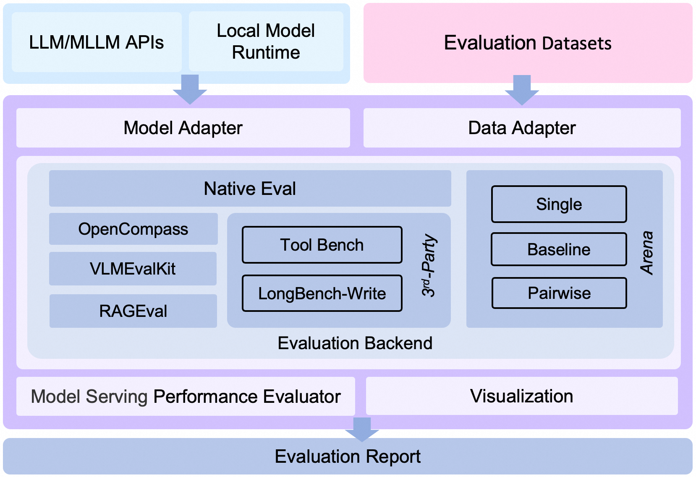

Qwen3 模型评测最佳实践：https://evalscope.readthedocs.io/zh-cn/latest/best_practice/qwen3.html

## 性能压测

https://evalscope.readthedocs.io/zh-cn/latest/user_guides/stress_test/parameters.html

## 效果测评

- https://evalscope.readthedocs.io/zh-cn/latest/get_started/basic_usage.html
- 推理模型评估：https://github.com/modelscope/evalscope/blob/main/docs/zh/best_practice/deepseek_r1_distill.md

## 架构图

    
     EvalScope 整体架构图.

架构介绍

1. **Model Adapter**: 模型适配器，用于将特定模型的输出转换为框架所需的格式，支持API调用的模型和本地运行的模型。

2. **Data Adapter**: 数据适配器，负责转换和处理输入数据，以便适应不同的评测需求和格式。

3. **Evaluation Backend**:
    - **Native**：EvalScope自身的**默认评测框架**，支持多种评测模式，包括单模型评测、竞技场模式、Baseline模型对比模式等。
    - **OpenCompass**：支持[OpenCompass](https://github.com/open-compass/opencompass)作为评测后端，对其进行了高级封装和任务简化，您可以更轻松地提交任务进行评测。
    - **VLMEvalKit**：支持[VLMEvalKit](https://github.com/open-compass/VLMEvalKit)作为评测后端，轻松发起多模态评测任务，支持多种多模态模型和数据集。
    - **RAGEval**：支持RAG评测，支持使用[MTEB/CMTEB](https://evalscope.readthedocs.io/zh-cn/latest/user_guides/backend/rageval_backend/mteb.html)进行embedding模型和reranker的独立评测，以及使用[RAGAS](https://evalscope.readthedocs.io/zh-cn/latest/user_guides/backend/rageval_backend/ragas.html)进行端到端评测。
    - **ThirdParty**：其他第三方评测任务，如ToolBench。

4. **Performance Evaluator**: 模型性能评测，负责具体衡量模型推理服务性能，包括性能评测、压力测试、性能评测报告生成、可视化。

5. **Evaluation Report**: 最终生成的评测报告，总结模型的性能表现，报告可以用于决策和进一步的模型优化。

6. **Visualization**: 可视化结果，帮助用户更直观地理解评测结果，便于分析和比较不同模型的表现。

## 数据集

modelscope download --dataset modelscope/cmmlu --local_dir ./cmmlu
modelscope download --dataset modelscope/ceval-exam --local_dir ./ceval
modelscope download --dataset modelscope/gsm8k --local_dir gsm8k

---

